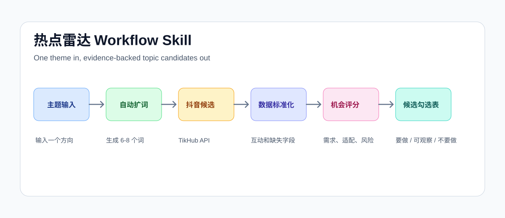
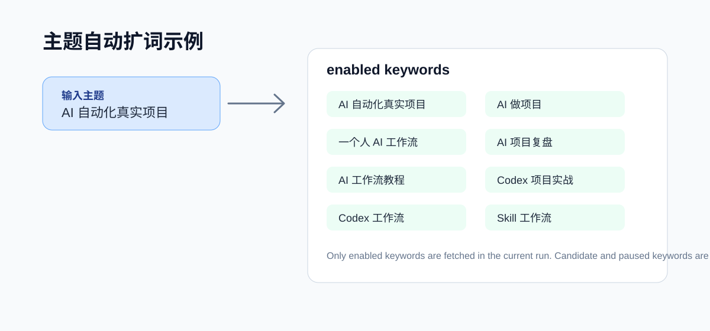

# Hotspot Radar Workflow Skill

[FIN-SV-004 成品能力与双层产品化说明](docs/productization-map.md) · [English](README_EN.md)

热点雷达 Workflow Skill 是一个可安装的 Agent Skill / Codex Skill。它面向短视频创作者、内容运营和 AI 工作流实践者：输入一个内容主题，它会自动扩展关键词、抓取抖音候选内容、基于互动数据和评论需求评分，并输出 10 条候选选题供人工判断。

它不是爆款保证器，也不是洗稿工具。它的目标是把“刷平台找灵感”变成可复用、可追溯、可筛选的选题发现流程。

**当前状态：**`v0.1.4` 固定版本候选，本地规则与 19 项测试已验证。**下一步：**按固定 Tag 安装，先运行无 Token 的本地检查；需要真实抓取时，再由用户自行配置合法取得的第三方 API Token。English readers: [README_EN.md](README_EN.md).

## 解决什么问题

很多创作者做选题时会遇到这些问题：

- 每天刷平台很耗时，但沉淀不下来。
- 只看点赞高低，容易把噪音当成机会。
- 一个主题不知道该扩展哪些搜索词。
- 第二次搜索又看到同一批内容，重复筛选。
- 想借鉴爆款结构，但又不想照搬、洗稿或踩版权风险。
- 团队讨论选题缺少统一判断表。

这个 Skill 解决的是“选题发现和候选筛选”这一段：它把一个主题变成一组可追溯的候选内容，再让人做最后判断。

## Who It Is For

- 做抖音、短视频、口播、录屏演示内容的创作者。
- 想用数据找对标选题，而不是只靠感觉刷平台的人。
- 想把 AI、Codex、Skill、工作流、项目实战等内容做成系列的人。
- 需要把“热点内容”转成“候选选题清单”的内容团队。

## What It Is Not

- 不是自动爆款预测器。
- 不是自动发布工具。
- 不是视频剪辑器。
- 不是一键洗稿工具。
- 不是全平台舆情系统。
- 不是免 Token 的数据服务。

## What It Does

- 输入一个主题，例如 `AI 自动化真实项目`。
- 自动扩展成 6 到 8 个相关关键词。
- 通过 TikHub API 搜索抖音候选内容。
- 标准化点赞、评论、收藏、分享、作者、标题、描述和缺失字段。
- 拉取部分评论样本，用来识别用户需求。
- 输出内容机会分，而不是承诺“爆款预测”。
- 同主题重复运行时，默认排除上一次已经返回过的候选。
- 生成 10 条候选选题勾选表：`要做 / 可观察 / 不要做`。

## 快速开始

要求：

- Node.js 18+
- macOS 推荐使用 Keychain 保存 Token
- TikHub API Token

## 安装

This repository itself is the installable Skill folder: `SKILL.md` is at the repository root, with supporting `scripts/`, `docs/`, and `assets/`.

With Codex Skill Installer, install the repository root:

`$skill-installer install https://github.com/slalomboy/hotspot-radar-workflow-skill/tree/v0.1.4`

After installing, restart Codex so the new Skill can be discovered.

Manual install:

1. Clone or download this repository.
2. Copy the repository folder to your Codex skills directory.
3. Confirm the installed folder contains `SKILL.md` and `scripts/`.
4. Restart Codex.

For local development or direct CLI use, run commands from the repository root.

## 第一次调用

先运行：

`npm run first-run`

如果提示缺少 Token，打开 TikHub 控制台获取 Token：

`https://user.tikhub.io/dashboard/api`

保存 Token：

`npm run setup-token`

再次检查：

`npm run first-run`

看到“总体状态：可真实抓取”后，输入主题：

`npm run topic -- "AI 自动化真实项目"`

生成结果会写入：

- `data/gate-1/runs/<run-id>/keywords/keyword-nodes.json`
- `data/gate-1/runs/<run-id>/normalized/content-candidates.json`
- `data/gate-1/runs/<run-id>/scores/opportunity-scores.json`
- `reports/gate-1/<run-id>-owner-review-checklist.md`

## Theme To Keywords

你只需要给一个大方向。系统会自动扩词。

例如输入：

`AI 自动化真实项目`

可能扩展为：

- `AI 自动化真实项目`
- `AI 做项目`
- `一个人 AI 工作流`
- `AI 项目复盘`
- `AI 工作流 保姆级教程`
- `Codex 项目实战`
- `Codex 工作流`
- `Skill 工作流`

只有 `enabled` 状态的关键词会进入当前抓取。扩词结果会保存到 `keyword-nodes.json`，每个关键词都有来源、类型、状态和原因。

## Workflow

## Scoring Model

当前 0.1.4 使用内容机会分，不使用“爆款预测”话术。

核心依据：

- 基础互动：点赞、评论、收藏、分享。
- 用户需求：评论里是否出现教程、怎么做、资料、案例、报错、求分享等需求。
- 赛道相关：是否贴合输入主题和扩展关键词。
- 账号适配：是否适合你自己的内容定位。
- 可迁移性：是否能换成自己的案例、观点、项目或方法。
- 结构清晰度：是否能拆成清楚的短视频结构。
- 风险扣分：夸张收益、版权依赖、照搬风险、敏感承诺等。

缺失数据会被标记为 missing，不会用 `0` 伪装成真实数据。

## API Provider

默认 TikHub API 地址：

`https://api.tikhub.io`

当前使用的 TikHub 路径：

- `POST /api/v1/douyin/search/fetch_general_search_v2`
- `GET /api/v1/douyin/app/v3/fetch_video_comments`

详见 [docs/api-provider.md](docs/api-provider.md)。

## 限制、隐私与公开边界

- 不要把 API Token 写进项目文件、报告、日志或 Git。
- 不要绕过登录、访问控制或平台技术限制。
- 不下载、不再分发原视频。
- 不逐句同义替换原作者内容。
- 输出只作为候选选题判断，不保证播放量或转化。
- 第三方 API 的缓存、商用和再分发权限由使用者自行确认。

## Documentation

- [安装教程](docs/installation.md)
- [使用教程](docs/usage.md)
- [接口配置](docs/api-provider.md)
- [流程说明](docs/workflow.md)
- [安全与合规](docs/security-and-compliance.md)
- [常见问题](docs/faq.md)

## Tests

`npm test`

`npm run check`

## 许可证与来源

原创代码与文档采用 [MIT License](https://github.com/slalomboy/hotspot-radar-workflow-skill/blob/v0.1.4/LICENSE)。TikHub API 与抖音平台内容属于第三方能力和数据，不在本仓库许可证授予范围内；价格、配额、接口和再分发条款需要使用者在调用时另行核验。

[English documentation](README_EN.md) · [English docs index](docs/en/README.md)
